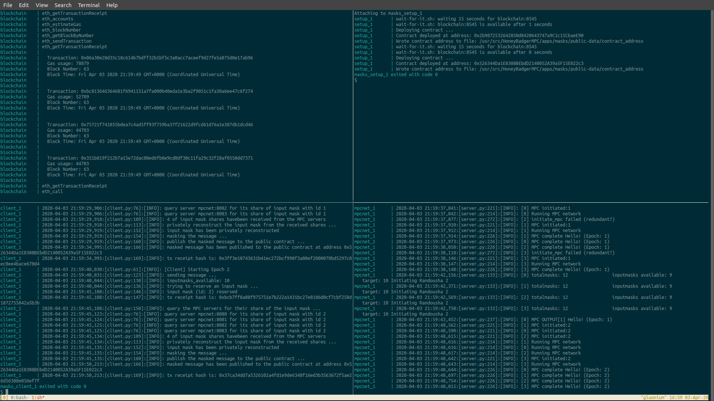

# Masks App
Simple MPC application in which a client can send a masked message to
an Ethereum (public) contract, and a network of servers perform a
simple Multi-Party Computation (MPC) to un-mask the secret message.

This simple application contains the building blocks for more complex
applications such as the message mixing application `asynchromix` found
under [apps/asynchromix](../asynchromix).

To run a demo of this app:

```shell
$ make run
```

You should then see something like:


