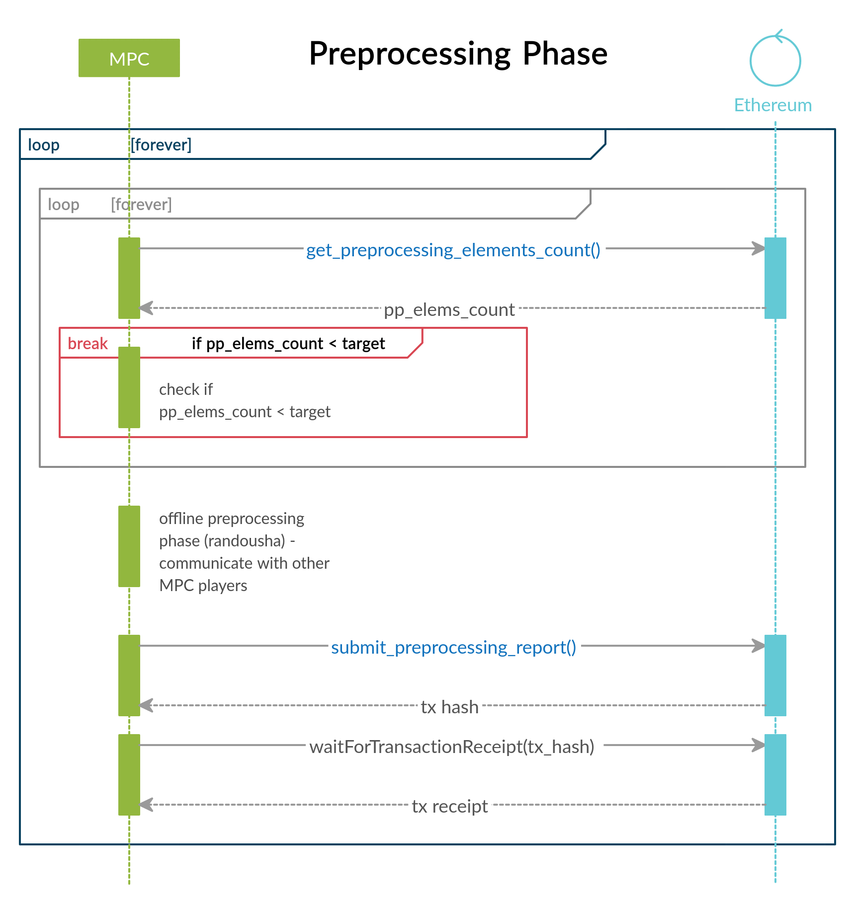
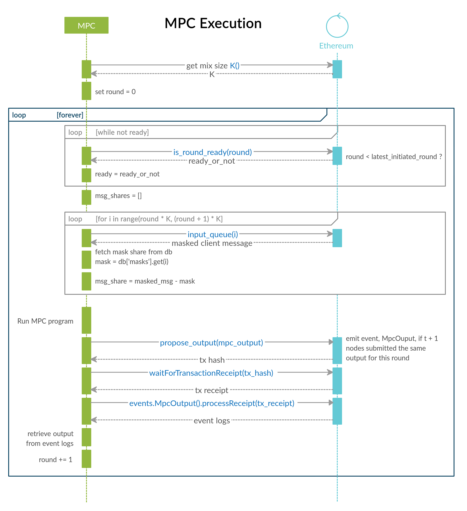

EthBadgerMPC SDK
================

+------------+--------------------+
| **STATUS** | *work-in-progress* |
+------------+--------------------+

The EthBadgerMPC SDK is a work-in-progress framework that aims to provide
basic components to help develop MPC applications which are orchestrated via
one or more Ethereum contracts, written in Vyper.

The SDK provides boilerplate code that can be used to develop the clients,
the MPC servers, and the Vyper contracts.

--

The first app was asynchromix which uses Ethereum as a "trusted" coordinator
to mix messages from clients.

We're currently trying to develop a framework to compose MPC applications with
Ethereum as a "trusted" coordinator. In the context of that effort, the
asynchromix application was revisited, and partially re-implemented using
that (work-in-progress) framework. It would perhaps be more accurate to say
that the framework originated out of the asynchromix application. The idea is
to provide a framework so that an application developer would mainly focus on
writing a smart contract along with an MPC extension, that would define what
the multiparty computation ought to do. A custom parser/compiler would take
care of splitting the Ethereum smart contract part from the MPC extension.

It's important to note this framework is currently purely experimental, but
can nevertheless be used as some kind of sand box by an application developer.
The reason why it can be used as a sandbox is because it is a self-contained
environment using docker containers, managed by docker-compose. The key
components of the framework are as follows:

* Ethereum (development) blockchain
* Smart contract deploying service
* MPC servers
* Client

Each component is run in a separate docker container, including each MPC
server. From the point of view of docker-compose each component is a service.
To give a concrete example, for a system containing 4 MPC players, and one
client, there will be 7 services/containers: 4 MPC player containers, 1
client, 1 contract deployer, 1 Ethereum blockchain.

The aim of the framework is to provide the generic code for the key
components, especially the MPC server code. Ideally, the application developer
would mostly focus on writing the smart contract along with the MPC extension.
For the purpose of the presentation of the concept, let's consider a custom
smart contract language that supports this extensibility option. We'll call
this language **ratelang** or *ratel* for short. Concretely speaking, this is
currently being implemented using **Vyper** as a basis. Let's consider the
following code snippet as an example, from the asynchromix2 contract:

.. code-block:: python

    @mpc
    async def prog(ctx, *, field_elements, mixer):
        shares = (ctx.Share(field_element) for field_element in field_elements)
        shuffled = await mixer(ctx, shares)
        shuffled_shares = ctx.ShareArray(ctx.Share(s) for s in shuffled)
        opened_values = await shuffled_shares.open()
        msgs = [
            m.value.to_bytes(32, "big").decode().strip("\x00")
            for m in opened_values
        ]
        return msgs

What we are working towards would be more or less like:

.. code-block:: python

    @mpc(pp_elements=('bits', 'triples')
    async def prog(sharearray: shares):
        mixed_shares = await shares.mix(algo='butterfly')
        return await mixed_shares.open()

The above snippet specifies an MPC program, along with the preprocessing
elements that it requires. The application developer would write this program
as part of a smart contract. The decorator ``@mpc`` acts as a marker to
indicate to the parser that this code has to be split from the part that is
aimed at the Ethereum EVM. For instance, here's an example of a code snippet
from the asynchromix2 smart contract that contains both Vyper (Ethereum smart
contract language) code and an MPC extension code, as shown above.

.. code-block:: python

    @public
    def propose_output(epoch: uint256,  output: string[1000]):
        assert epoch < self.epochs_initiated    # can't provide output if it hasn't been initiated
        assert self.servermap[msg.sender] > 0   # only valid servers
        id: int128 = self.servermap[msg.sender] - 1
    
        # Each server can only vote once per epoch
        assert epoch <= self.server_voted[id]
        self.server_voted[id] = max(epoch + 1, self.server_voted[id])
    
        output_hash: bytes32 = keccak256(output)
    
        if self.output_votes.votes[epoch] > 0:
            # All the votes must match
            assert output_hash == self.output_hashes.hashes[epoch]
        else:
            self.output_hashes.hashes[epoch] = output_hash
    
        self.output_votes.votes[epoch] += 1
        if self.output_votes.votes[epoch] == self.t + 1:   # at least one honest node agrees
            log.MpcOutput(epoch, output)
            self.outputs_ready += 1

    @mpc(pp_elements=('bits', 'triples')
    async def prog(sharearray: shares):
        mixed_shares = await shares.mix(algo='butterfly')
        return await mixed_shares.open()

The above snippet contains a public Vyper function, and an MPC
function/program. The first step of the compiler is to split those 2 apart.
Once split, the Ethereum-specific part is fed to the Vyper compiler to produce
the bytecode and so forth. Roughly speaking, the MPC part is fed to the
application framework. If we are being more specific and concrete, the current
implementation works by simply producing a string representation of the MPC
program and passing it to Python's ``exec`` built-in function. The MPC program
is then passed to the MPC server code, provided by the framework. The
specified preprocessing elements would also be passed to the preprocessing
and MPC server modules thus indicating to these components that the specified
elements must be generated.

HoneyBadgerMPC does not have a virtual machine or runtime environment but one
could easily imagine that the MPC part of the smart contract could be compiled
to a bytecode for a particular targeted virtual machine of an MPC system.
Say for instance, one wishes to run an MPC program on MP-SPDZ, then the
mechanics of what has been presented so far could be used to support writing
MP-SPDZ -compatible MPC programs that would integrate in a larger system which
would include Ethereum as a "trusted" coordinator.

Implementation
--------------
Things to note:

* "Independent" preprocessing module
* HTTP server to handle client requests, using ``aiohttp``
* MPC program runner / server that runs the actual MPC program, which is
  specified in the smart contract
* Persistence layer using LevelDB, mainly to store the preprocessing elements
* Smart contract language is Vyper with MPC extensibility support, implemented
  in ``ratelang``: https://github.com/ratelang/ratel

Using the framework as a stepping stone towards a testnet
^^^^^^^^^^^^^^^^^^^^^^^^^^^^^^^^^^^^^^^^^^^^^^^^^^^^^^^^^
An application developer wishing to spin their application into a test network
may benefit substantially from the proposed framework. Given that each key
component is already isolated, and running in its own separate container, it
somewhat mimics, loosely speaking, a real-world "testnet" scenario. Hence, one
may use the framework as a stepping stone towards deploying an actual test
network.

Things missing
""""""""""""""
Some key things are most certainly missing, some of which are:

* Secure communication betweeen MPC servers (TLS sockets with zeromq).
* Client authorization mechanism. When receiving a client request for a
  share of an input mask, an MPC server should only send its share if the
  client is authorized. `Not exactly sure on how to do this, perhaps using
  the client's ethereum public key ...`.

Ratelang: Vyper + HoneyBadgerMPC
^^^^^^^^^^^^^^^^^^^^^^^^^^^^^^^^
Ratelang is the current codename for this somewhat hybrid language that
contains Ethereum's smart contract Vyper language and Python-like MPC program
definitions.

The overall implementation is currently very simple: the hybrid language is
parsed and split into 2 distinct parts: pure Vyper code, and pure MPC/Python
code. Each part is then processed separately: (1) the Vyper code is compiled
using Vyper's compiler; (2) the MPC program definitions are simply put into
their string representations, which can then be compiled and executed using
Python's built-in ``exec`` function. Some future work could make it possible
to compile the MPC program definition into bytecode, assuming there would
be a suitable virtual machine that can execute that bytecode.

The current implementation is very raw, in the sense that the MPC program
definition is coded as it was or would be if one was writing it in using
the HoneyBadgerMPC codebase. The aim however is to provide a higher-level
abstraction as was noted above. For the asynchromix example, the higher-level
abstraction would look like:

.. code-block:: python

    K: constant(uint256) = 32  # mix size
    PER_MIX_TRIPLES: constant(uint256) = (K / 2) * 5 * 5
    PER_MIX_BITS: constant(uint256) = (K / 2) * 5 * 5

    @mpc(pp_elements=('bits', 'triples')
    async def prog(sharearray: shares):
        mixed_shares = await shares.mix(algo='butterfly')
        return await mixed_shares.open()

The ``@mpc`` decorator's key role is to identify this code as MPC code,
meaning "not" Vyper (Ethereum) code. The ``@mpc`` decorator can also be
passed arguments to specify which preprocessing elements the MPC program
requires.

Information/Program Flow
------------------------
There are 3 types of "actors" to consider:

* clients
* MPC players
* Ethereum blockchain

The ethereum blockchain may treated as "trusted" entity that plays an
orchestrating or coordinating role. In a way it acts as a state machine,
ensuring that the clients and MPC players proceed in lock steps according to
the intended protocol.

client
^^^^^^
A client wishing to send a message does the following:

* [comm with ETH] Wait for input masks to be available by querying the Ethereum contract.
  (state check - contract func: ``inputmasks_available()``)
* [comm with ETH] Reserve an input mask once possible, by committing a transaction to the
  Ethereum contract. (transaction - contract func: ``reserve_inputmask()``)
* [comm with MPC] Once the transaction has gone through, request the input mask shares
  from each MPC server.
* [local] Privately reconstruct the input mask.
* [local] Mask the message.
* [comm with ETH] Send the masked message to the contract. (transaction -
  contract func: ``submit_message()``)

.. figure:: docs/_static/client-seq-diagram.png

    Client sending a message to the Ethereum contract.

MPC server
^^^^^^^^^^
An MPC server runs the following 3 processes simulataneously:

* offline preprocessing phase -- requires communication with other MPC players
* HTTP server to handle client requests for input masks (shares) -- requires
  communication with clients (listening to incoming requests and replying to
  the requests, i.e. receive and send)
* MPC program execution -- requires communication with other MPC players

offline preprocessing phase
"""""""""""""""""""""""""""
MPC servers run an "offline" preprocessing phase in the background to keep
a sufficient buffer of preprocessing elements for the multi-party computation
and for random shares used by clients to mask their inputs. The MPC servers
periodically submit a "preprocessing" report to an Ethereum contract. This
report enables to clients to check whether there are input masks available.

* [comm with MPC players] Generate a batch of preprocessing elements.
* [comm with ETH] After a batch has been generated, submit a preprocessing
  report to the Ethereum smart contract to update the quantity of
  preprocessing elements that are available. (transaction - contract func:
  ``preprocess_report()``)
* [local] Each MPC server stores the preprocessing elements (shares) it has
  generated in its local key/value (LevelDB) store.

The Ethereum contract maintains the "state" of the preprocessing elements that
are available for usage, and those that have been used. This "state" is
consulted by both clients and MPC players. The clients consult this state
to check whether input masks are available meanwhile MPC players consult this
state to know whether they should generate more batches of preprocessing
elements.

Contract functions which are invoked during the preprocessing phase:

* ``pp_elems_available()``
* ``preprocess_report()``

    Preprocessing phase coordinated with an Ethereum smart contract.

Handling client requests
""""""""""""""""""""""""
This background task does not require any interaction with the Ethereum
contract. A simple HTTP server runs continuously, listening to incoming
client requests for input mask shares. Input masks are identified and
requested via a unique id, which MPC servers use to fetch from their local
key/value (LevelDB) store.

MPC program execution
"""""""""""""""""""""
An MPC server runs one main loop to mix batches of messages sent by clients.
In this context, each loop corresponds to a round, or epoch, meaning that
for each batch of messages that are mixed, a round is completed. In order
to know whether a mixing round should be started, a background loop is run
which checks whether there are enough client messages ready and preprocessing
elements.

.. rubric:: initiating a mixing round

Although each MPC server executes this loop, only one player is needed to
initiate a round. Once a round has been initiated by one player, the
attempts of other players will fail, for that particular round.

.. code-block:: python
    
    async def initiate_mixing_round(self):
        K = self.contract.K()  # noqa: N806
        while True:
            while True:
                inputs_ready = self.contract.caller.inputs_ready()
                mixes_avail = self.contract.caller.mixes_available()
                if inputs_ready >= K and mixes_avail >= 1:
                    break
                await asyncio.sleep(5)

            tx_hash = self.contract.caller(
                {"from": self.w3.eth.accounts[0]}
            ).initiate_mpc()
            tx_receipt = await self.w3.eth.waitForTransactionReceipt(tx_hash)
            await asyncio.sleep(10)

.. rubric:: main loop: executing the multiparty computation

.. code-block:: python

    async def mix(self):
        K = self.contract.caller.K()
        epoch = 0
        while True:

            # wait for round to be started
            while True:
                epochs_initiated = self.contract.caller.epochs_initiated()
                if epochs_initiated > epoch:
                    break

            # read client masked inputs from contract
            # get share of input
            message_shares = []
            for idx in range(epoch * K, (epoch + 1) * K):
                masked_message, mask_id = self.contract.caller.input_queue(idx)
                inputmask = self.elements["inputmasks"][mask_id]
                msg_share = masked_message - inputmask
                message_shares.append(msg_share)

            # run MPC program
            result = await MPC(self.prog, message_shares).run()

            # propose output to contract
            tx_hash = self.contract.caller(
                {"from": self.w3.eth.accounts[self.myid]}
            ).propose_output(epoch, result)

            # wait for tx
            tx_receipt = await self.w3.eth.waitForTransactionReceipt(tx_hash)

            # retrieve output from contract event
            rich_logs = self.contract.events.MpcOutput().processReceipt(tx_receipt)
            if rich_logs:
                epoch = rich_logs[0]["args"]["epoch"]
                output = rich_logs[0]["args"]["output"]

            epoch += 1

    MPC execution phase coordinated with an Ethereum smart contract.

Ethereum contract
^^^^^^^^^^^^^^^^^
The contract defines the following key functions and data structures:

**data structures**

* ``InputQueue``: stores the masked messages submitted by clients
* ``PreProcessCount``: stores the counts of preprocessing elements
* ``OutputVotes``: stores votes for each round

**functions**

* ``inputmasks_available()``
* ``reserve_inputmask()``
* ``initiate_mpc()``
* ``propose_output()``
* ``inputs_ready()``
* ``pp_elems_available``
